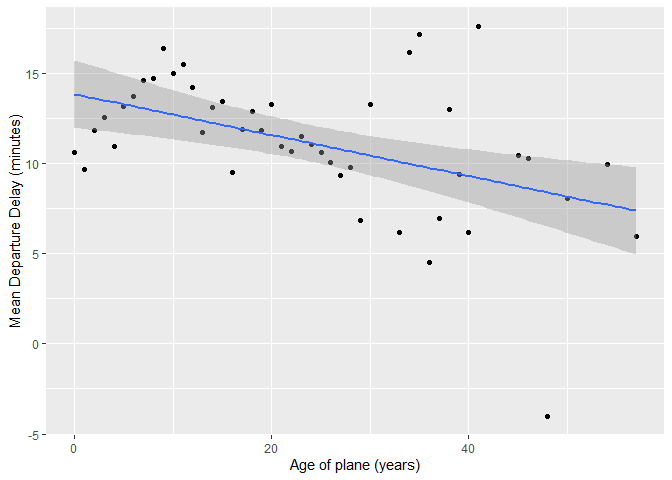
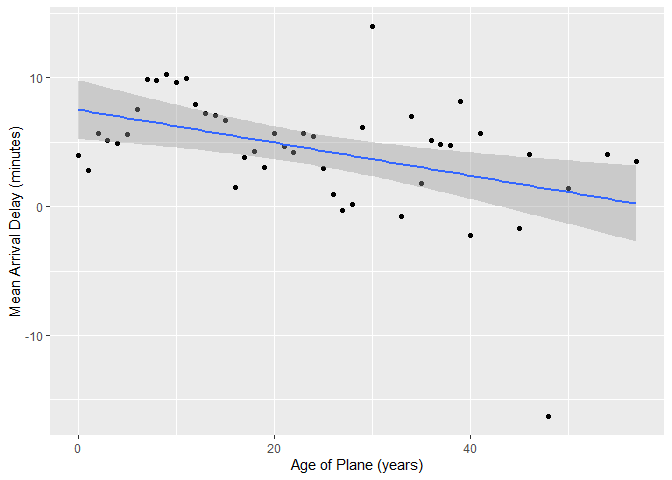

hw3
================
Jiaheng Lyu
2022-10-18

## Q1

> Compute the average delay by destination, then join on the airports
> data frame so you can show the spatial distribution of delays. Here’s
> an easy way to draw a map of the United States:

``` r
airports %>%
  semi_join(flights, c("faa" = "dest")) %>%
  ggplot(aes(lon, lat)) +
    borders("state") +
    geom_point() +
    coord_quickmap()
```

<!-- -->

``` r
q1 = flights %>%
  group_by(dest) %>%
  summarise(delay = mean(arr_delay, na.rm = T)) %>%
  inner_join(airports, c(dest = "faa")) %>%
  ggplot(aes(lon, lat, colour = delay)) +
  borders("state") +
  geom_point() +
  coord_quickmap()
q1
```

<!-- -->

## Q2

> Add the location of the origin and destination (i.e. the **lat** and
> **lon**) to **flights**.

``` r
q2 = flights %>%
  left_join(
    airports %>% select(faa, lat, lon),
    by = c("origin" = "faa")
  ) %>%
  left_join(
    airports %>% select(faa, lat, lon),
    by = c("dest" = "faa"),
    suffix = c("_origin", "_dest")
  )

q2[, c(1:3, 17, 13, 20, 21, 14, 22, 23)] %>%
  head(20)
```

    ## # A tibble: 20 × 10
    ##     year month   day  hour origin lat_origin lon_origin dest  lat_dest lon_dest
    ##    <int> <int> <int> <dbl> <chr>       <dbl>      <dbl> <chr>    <dbl>    <dbl>
    ##  1  2013     1     1     5 EWR          40.7      -74.2 IAH       30.0    -95.3
    ##  2  2013     1     1     5 LGA          40.8      -73.9 IAH       30.0    -95.3
    ##  3  2013     1     1     5 JFK          40.6      -73.8 MIA       25.8    -80.3
    ##  4  2013     1     1     5 JFK          40.6      -73.8 BQN       NA       NA  
    ##  5  2013     1     1     6 LGA          40.8      -73.9 ATL       33.6    -84.4
    ##  6  2013     1     1     5 EWR          40.7      -74.2 ORD       42.0    -87.9
    ##  7  2013     1     1     6 EWR          40.7      -74.2 FLL       26.1    -80.2
    ##  8  2013     1     1     6 LGA          40.8      -73.9 IAD       38.9    -77.5
    ##  9  2013     1     1     6 JFK          40.6      -73.8 MCO       28.4    -81.3
    ## 10  2013     1     1     6 LGA          40.8      -73.9 ORD       42.0    -87.9
    ## 11  2013     1     1     6 JFK          40.6      -73.8 PBI       26.7    -80.1
    ## 12  2013     1     1     6 JFK          40.6      -73.8 TPA       28.0    -82.5
    ## 13  2013     1     1     6 JFK          40.6      -73.8 LAX       33.9   -118. 
    ## 14  2013     1     1     6 EWR          40.7      -74.2 SFO       37.6   -122. 
    ## 15  2013     1     1     6 LGA          40.8      -73.9 DFW       32.9    -97.0
    ## 16  2013     1     1     5 JFK          40.6      -73.8 BOS       42.4    -71.0
    ## 17  2013     1     1     6 EWR          40.7      -74.2 LAS       36.1   -115. 
    ## 18  2013     1     1     6 LGA          40.8      -73.9 FLL       26.1    -80.2
    ## 19  2013     1     1     6 LGA          40.8      -73.9 ATL       33.6    -84.4
    ## 20  2013     1     1     6 EWR          40.7      -74.2 PBI       26.7    -80.1

## Q3

> Is there a relationship between the age of a plane and its delays?

- In general, with the age of plane increasing, the delays decrease (no
  matter the departure delay or arrival delay)  
- To be more detailed, delays increase with the age of plane until ten
  years, then it delines

``` r
q3 = flights %>%
  inner_join(planes %>% select(tailnum, plane_year = year), by = "tailnum") %>%
  mutate(plane_age = year - plane_year) %>%
  filter(!is.na(plane_age)) %>%
  group_by(plane_age) %>%
  summarise(
    dep_delay_mean = mean(dep_delay, na.rm = TRUE),
    arr_delay_mean = mean(arr_delay, na.rm = TRUE)
  )
  
ggplot(q3, aes(x = plane_age, y = dep_delay_mean)) +
  geom_point() +
  geom_smooth(method=lm) +
  xlab("Age of plane (years)") +
  ylab("Mean Departure Delay (minutes)")
```

    ## `geom_smooth()` using formula 'y ~ x'

<!-- -->

``` r
ggplot(q3, aes(x = plane_age, y = arr_delay_mean)) +
  geom_point() +
  geom_smooth(method=lm) +
  xlab("Age of Plane (years)") +
  ylab("Mean Arrival Delay (minutes)")
```

    ## `geom_smooth()` using formula 'y ~ x'

<!-- -->

``` r
lm(plane_age ~ dep_delay_mean, data = q3)
```

    ## 
    ## Call:
    ## lm(formula = plane_age ~ dep_delay_mean, data = q3)
    ## 
    ## Coefficients:
    ##    (Intercept)  dep_delay_mean  
    ##         44.741          -1.874

``` r
lm(plane_age ~ arr_delay_mean, data = q3)
```

    ## 
    ## Call:
    ## lm(formula = plane_age ~ arr_delay_mean, data = q3)
    ## 
    ## Coefficients:
    ##    (Intercept)  arr_delay_mean  
    ##         30.433          -1.465
